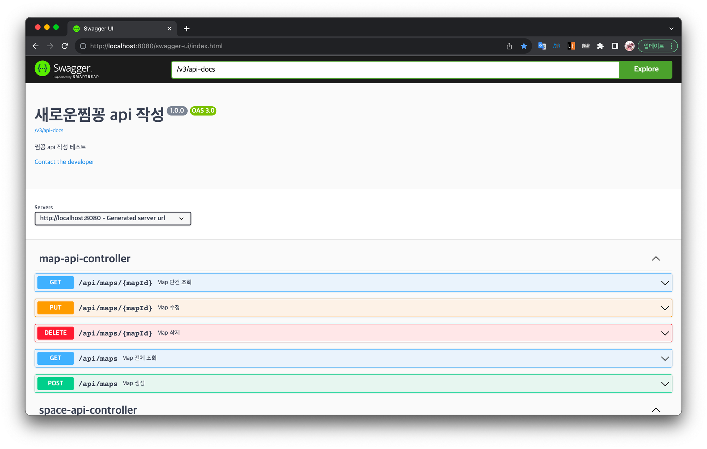

# CodeGen Demo

CodeGen을 사용해보는 프로젝트입니다.

# 실행 방법 - 문서 생성

```bash
gradle openApiGenerate
```


> 
> 
> intelliJ 기준 설명
> 
> gradle task중 `openapi tools` - `openApiGenerate`를 실행한다.

> 
> 
> `build/generated` 경로에 결과물이 생성된다.

# 실행방법 - 실행

```bash
$ gradle updateOpenApiSpec

$ gradle build

$ java -jar build/libs/demo.jar
```

> 
> 
> intelliJ 기준 설명
>  
> gradle task중 `openapi tools` - `openApiGenerate`를 실행한다.

# 실행 화면

http://localhost:8080/swagger-ui/index.html 접속



# 참고

- [OpenAPI Generator Repository](https://github.com/OpenAPITools/openapi-generator)
